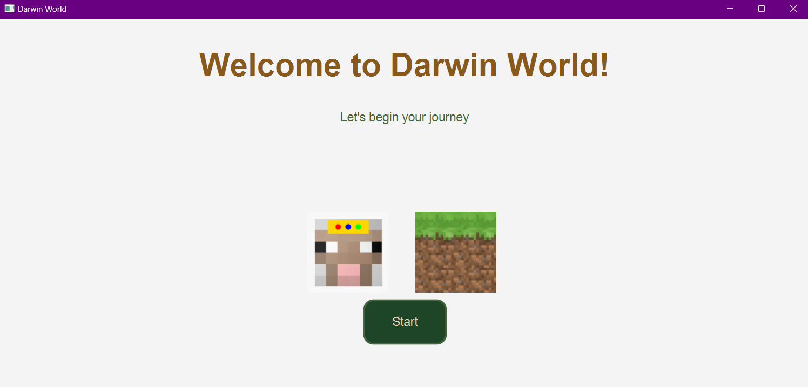
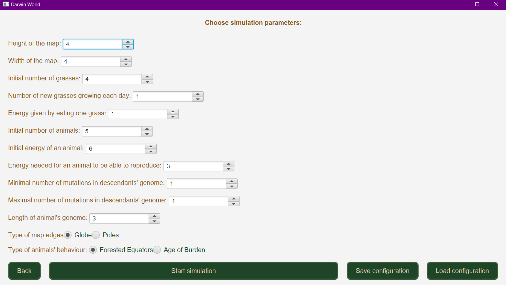
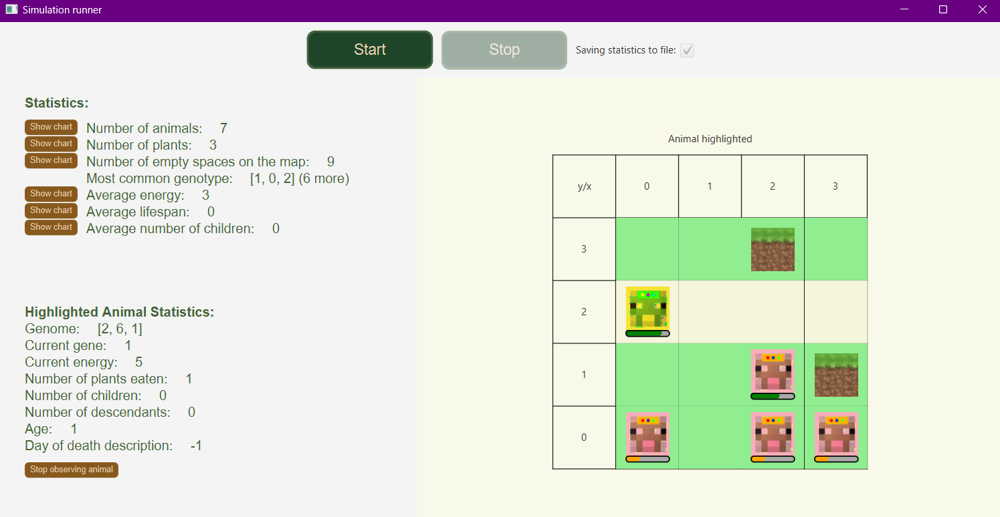
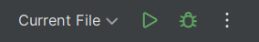

# Darwin World
## Summary
This repository contains the Darwin World application wrriten in Java. It was designed for Object Oriented Programming laboratories at AGH
## About
Darwin World simulates life cycles of animals on a world grid. Users can modify starting parameters, run multiple simulations and watch how animals behave day by day . As the simulation is running, users can also view board statistics, observe charts or highlight individual  animals to know more about it.
## Screenshots

## How to run
App was developed and tested in [IntelliJ IDEA](https://www.jetbrains.com/idea/). Therefore you can run it directly in IntelliJ by click Run button:

Alternatively you can run in command line. Navigate to the root directory and enter: `cd ./oolab` and `./gradlew run`

## App architecture and logic 
Structure of app was build to meet requirements described in [this repository](https://github.com/Soamid/obiektowe-lab/tree/master/proj). Project implements variant A4 and provides fully functional version of the application.

## Contributors
- Seweryn Tasior
- Marta Stanisławska

## License
Darwin World is distributed under the terms of the MIT License. See the license [for more information](https://choosealicense.com/licenses/mit/).