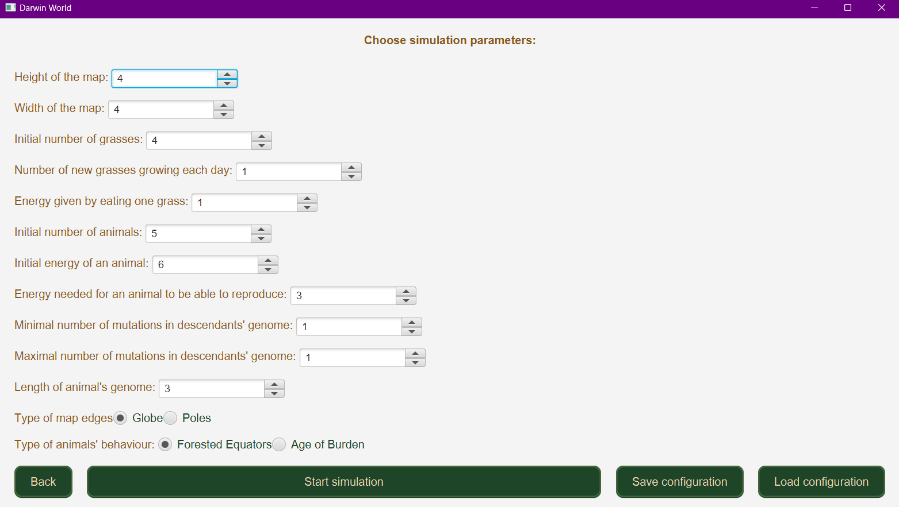
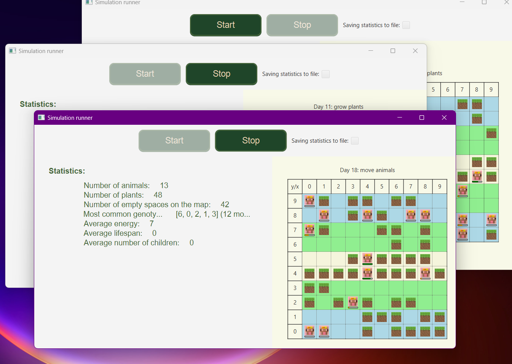
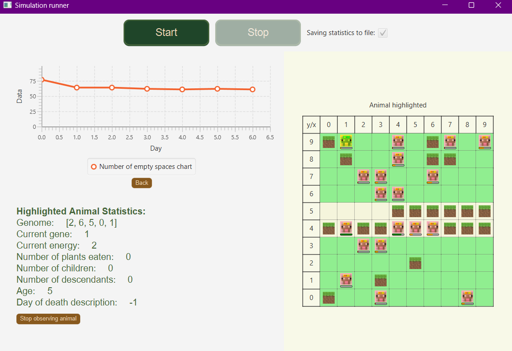

# Darwin World
## Summary
This repository contains the Darwin World application wrriten in Java. It was designed for Object Oriented Programming laboratories at AGH UST.
## About
Darwin World simulates life cycles of animals on a world grid. Users can modify starting parameters, run multiple simulations and watch how animals behave day by day. As the simulation is running, users can also view board statistics, observe charts or highlight individual animals to know more about it.
### Start

### Conifguration

Users can enter parameters for simulation configuration. When start is clicked, configuration is validated. If errors occur, suitable message is displayed. Furthermore configuration can be saved to or read from CSV file.
### Simulation windows

Every simulation runs in a separate window. In order to achieve this concurrency techniques were used. 
Animals can reproduce, move in random places, eat grass or mutate. Each day takes energy from animal. By eating grass animal can increase energy. If energy reaches 0, animal dies. More about app architecure, you can find in [section below](#app-architecture-and-logic )
### Simulation statistics

In statistics you can observe charts.The Animal clicked on board is observed and shown with a crown in yellow color. Addtionaly, there are statistics displayed for this animal.
## How to run
App was developed and tested in [IntelliJ IDEA](https://www.jetbrains.com/idea/). Therefore you can run it directly in IntelliJ by click Run button:

Alternatively you can run in command line. Navigate to the root directory and enter: `cd ./oolab` and `./gradlew run`

## App architecture and logic 
Structure of app was build to meet requirements described in [this repository](https://github.com/Soamid/obiektowe-lab/tree/master/proj). Project implements variant A4 and provides fully functional version of the application.

## Contributors
- Seweryn Tasior
- Marta Stanisławska

## License
Darwin World is distributed under the terms of the MIT License. See the license [for more information](https://choosealicense.com/licenses/mit/).